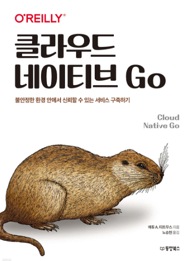

# HongJungWan-goRoad

### 𝙄𝙛 𝙮𝙤𝙪'𝙧𝙚 𝙣𝙚𝙬 𝙩𝙤 𝙂𝙤(𝙂𝙞𝙣/𝙂𝙊𝙍𝙈), 𝙝𝙚𝙧𝙚'𝙨 𝙖 𝙧𝙤𝙖𝙙𝙢𝙖𝙥 🛫

반갑습니다.

주어진 환경에서 최고의 제품을 만들기 위해 함께 학습해 봅시다.

  

### STEP #0, "Mind"

뜬금없이, 뭔 마인드냐 하실 수 있겠지만 Gopher의 길은 험난합니다.

아래의 링크를 보면서 잠깐이나마 그동안 부끄러움 없이 학습을 했는지 지난 시간을 되돌아봅니다.

 

* 경력만 많고 실력은 주니어 수준이 아닌가 반성해 봅니다.

* 주니어니까 괜찮다는 마음가짐을 가진 개발자가 아닌가 반성해 봅니다.

* 남 탓, 환경 탓, 기술 탓을 하는 개발자가 아닌가 반성해 봅니다.

 

#### [포프 - 주니어니까 괜찮아](https://www.youtube.com/watch?v=xrtrSdybVmE&list=PLW_uvsSPlijvEGUPKXOTPaJFlSAZ12Tfy)

#### [포프 - 개발 경력 3년이면](https://www.youtube.com/watch?v=ie2epvAsAGE&list=PLW_uvsSPlijvEGUPKXOTPaJFlSAZ12Tfy&index=2)

#### [포프 - 질문하는 법](https://www.youtube.com/watch?v=LjcMes6LJHs)

#### [포프 - 남이 날 주니어 프로그래머로보는 이유](https://www.youtube.com/watch?v=UFbHFPiR35k)

#### [포프 - 도메인 지식만 많은 넌 주니어](https://www.youtube.com/watch?v=uwbL-JljfAc)

  

### STEP #1, "Tucker의 Go 언어 프로그래밍 - 요약"

우선.. 기본적인 문법을 학습합시다. 📚

아래 목차를 기준으로 자율적으로 학습합니다.

| 제목                       | 링크                                                                                                                                                           |
|--------------------------|--------------------------------------------------------------------------------------------------------------------------------------------------------------|
| **#1, 프로그래밍 언어 - 개요**    | [완료](https://github.com/HongJungWan/HongJungWan-goRoad/blob/main/go/%ED%94%84%EB%A1%9C%EA%B7%B8%EB%9E%98%EB%B0%8D_%EC%96%B8%EC%96%B4_%EA%B0%9C%EC%9A%94.md)  |
| **#2, 변수, 연산자, 함수 - 기본** | [완료](https://github.com/HongJungWan/HongJungWan-goRoad/blob/main/go/%EB%B3%80%EC%88%98_%EC%97%B0%EC%82%B0%EC%9E%90_%ED%95%A8%EC%88%98_%EA%B8%B0%EB%B3%B8.md) |
| **#3, 상수, if, for, 배열**  | [완료](https://github.com/HongJungWan/HongJungWan-goRoad/blob/main/go/%EC%83%81%EC%88%98_if_for_%EB%B0%B0%EC%97%B4.md)                                         |
| **#4, 구조체**              | [작성 중...]()                                                                                                                                                  |
| **#5, 포인터**              | [완료](https://github.com/HongJungWan/HongJungWan-goRoad/blob/main/go/%ED%8F%AC%EC%9D%B8%ED%84%B0.md)                                                                                                                                                       |
| **#6, 문자열**              | [완료](https://github.com/HongJungWan/HongJungWan-goRoad/blob/main/go/%EB%AC%B8%EC%9E%90%EC%97%B4.md)                                                                                                                                                  |
| **#7, 패키지**              | [완료](https://github.com/HongJungWan/HongJungWan-goRoad/blob/main/go/%ED%8C%A8%ED%82%A4%EC%A7%80.md)                                                          |
| **#8, 슬라이스, 메서드**        | [작성 중...]()                                                                                                                                                  |
| **#9, 인터페이스**            | [완료](https://github.com/HongJungWan/HongJungWan-goRoad/blob/main/go/%EC%9D%B8%ED%84%B0%ED%8E%98%EC%9D%B4%EC%8A%A4.md)                                                                                                                                                  |
| **#10, 함수 - 고급**         | [작성 중...]()                                                                                                                                                  |
| **#11, 에러 반환**           | [완료](https://github.com/HongJungWan/HongJungWan-goRoad/blob/main/go/%EC%97%90%EB%9F%AC_%EB%B0%98%ED%99%98.md)                                                |
| **#12, 고루틴**             | [완료](https://github.com/HongJungWan/HongJungWan-goRoad/blob/main/go/%EA%B3%A0%EB%A3%A8%ED%8B%B4.md)                                                          |
| **#13, 채널**              | [완료](https://github.com/HongJungWan/HongJungWan-goRoad/blob/main/go/%EC%B1%84%EB%84%90.md)                                                                                                                                                  |

  

만약, 위에 내용이 너무 이론적인 내용이다 싶으면 아래 링크에 접속해 직접 코드를 실행시켜 보면서 가볍게 Go가 이런거구나 느껴봅시다.

### [30분 Go - programmers](https://school.programmers.co.kr/learn/courses/13/13-30%EB%B6%84-go)

  

나는 강의가 듣고 싶다하면, 아래의 인프런 링크를 참고합니다.

### [쉽고 빠르게 끝내는 GO언어 프로그래밍 핵심 기초 입문 과정](https://www.inflearn.com/course/go%EC%96%B8%EC%96%B4#curriculum)

  

인프런 강의는 너무 무겁고, 궁금한 목차만 듣고 싶다면 아래의 링크를 참고합니다.

### [tech school/simple bank](https://github.com/techschool/simplebank?tab=readme-ov-file)

  

아래는 한국에서 Go 바이블인 터커님의 유튜브 링크입니다.

### [Tuker의 Go 언어 프로그래밍 (완)](https://www.youtube.com/watch?v=KBdz5c-0t1w&list=PLy-g2fnSzUTBHwuXkWQ834QHDZwLx6v6j)

### [Tucker의 Go로 배우는 자료구조와 알고리즘](https://www.youtube.com/playlist?list=PLy-g2fnSzUTBTLpaVjy2-xesCbai9WIuI)

  

아티클을 참고 해야된다면 아래의 링크를 참고합니다.

### [Go 101](https://go101.org/article/101.html)

  

### STEP #2, 프로그래머스 && 백준 - 100 문제

Go 언어로 PS(Problem Solving) 하면서 자신감을 키워봅시다. 🧐

| 제목           | 링크                                               |
|--------------|--------------------------------------------------|
| 문자열 문제       | [링크](https://www.acmicpc.net/workbook/view/9432) |
| 완전 탐색 문제     | [링크](https://www.acmicpc.net/workbook/view/7770) |
| DFS & BFS 문제 | [링크](https://www.acmicpc.net/workbook/view/1833) |
| 구현 & 시뮬레이션   | [링크](https://www.acmicpc.net/workbook/view/9730) |
| 투 포인터        | [링크](https://www.acmicpc.net/workbook/view/13376) |

  

### STEP #3, Deep Dive

 

다들 Effective Java라는 책을 아시죠? 아래의 링크는 effective-go의 한글 번역본입니다.

### [Effective-Go summary](https://github.com/HongJungWan/effective-go/blob/master/SUMMARY.md)

  

아래 링크는 Go 학습 후, Deep Dive를 위해 한번 훑어 보면 좋은 질문들 입니다.

### [Golang Interview Questions](https://www.interviewbit.com/golang-interview-questions/)

  

Clean Code 너무 유명한 책이죠. 아래의 링크는 Clean Code의 내용을 어떻게 Go에 녹여낼 수 있을까? 고민한 아티클입니다.

### [Clean Go Code](https://github.com/Pungyeon/clean-go-article?tab=readme-ov-file#Test-Driven-Development)

  

문법을 익히는 단계에서는 다소 벅찰 수 있는 책이지만 Deep Dive에 있어서는 적절한 선택입니다.

### Cloud Native Go

  

50만원 상당의 유료 강의입니다.

돈이 아깝다는 생각이 든다면, 존중합니다.

다만, Gopher는 개발에 투자를 아끼지 않습니다.

### Comento 유료 강의

#### [Golang으로 클린 코드 만들고, 고성능 데이터 처리 SW 개발](https://comento.kr/class/pt/content/golang%EC%9C%BC%EB%A1%9C-%ED%81%B4%EB%A6%B0%EC%BD%94%EB%93%9C-%EB%A7%8C%EB%93%A4%EA%B3%A0-%EA%B3%A0%EC%84%B1%EB%8A%A5-%EB%8D%B0%EC%9D%B4%ED%84%B0-%EC%B2%98%EB%A6%AC-%EC%86%8C%ED%94%84%ED%8A%B8%EC%9B%A8%EC%96%B4-%EA%B0%9C%EB%B0%9C%ED%95%98%EA%B8%B0/135)

  

### STEP #4, GORM

어중간한 블로그 아티클 보다 공식 문서가 더 좋습니다.

### [GORM 공식 문서](https://gorm.io/docs/index.html)

  

### STEP #5, Gin

어중간한 블로그 아티클 보다 공식 문서가 더 좋습니다.

### [Gin 공식 문서](https://gin-gonic.com/ko-kr/docs/examples/)

  
