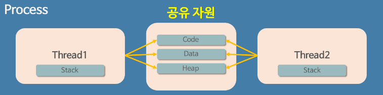

## Tucker의 Go 언어 프로그래밍 - 요약

<br>

### #13 고루틴

<br><br>

### **스레드란 🤔**



- 스레드는 프로세스 내에서 실행되는 여러 흐름의 단위로, 동일한 프로세스 내의 스레드들은 메모리와 자원을 공유한다. 이는 스레드들이 효율적으로 통신할 수 있게 하며, 자원의 오버헤드를 줄여준다.


- 각 스레드는 독립적인 실행 흐름을 가지며, 자신만의 스택(Stack)을 가지고 있지만, 힙(Heap) 메모리는 다른 스레드와 공유한다.

<br><br>

### **컨텍스트 스위칭 비용**

- 컨텍스트 스위칭은 CPU가 이전에 수행하던 작업의 상태(컨텍스트)를 저장하고, 다음 작업의 상태를 불러오는 과정이다. 
- 이 과정은 시스템의 오버헤드를 발생시키며, 오버헤드는 스레드의 수와 상태 전환의 빈도에 따라 증가한다.

<br>

- 컨텍스트 스위칭의 비용은 아래와 같은 요소에 영향을 받는다.
    - `CPU 캐시 초기화`, `메모리 관리 비용`, `스케줄링 지연`

<br>

- **성능 저하**
    - 멀티 스레딩은 병렬 처리를 가능하게 하여 성능을 향상시킬 수 있지만, 너무 많은 스레드가 활성화되면 각 스레드의 성능이 오히려 저하될 수 있다. 
      - 이는 컨텍스트 스위칭 비용과 스레드 간의 경쟁 상태(예: 잠금 경쟁) 때문일 확률이 높다. 
      
      <br>
      
    - 스레드 수를 적절하게 조절하며, 스레드 간의 동기화를 적절히 처리하는 것이 중요하다.

<br><br>

### **고루틴**

* `메인 루틴`: Go 프로그램이 시작하면, main() 함수가 자동으로 실행되는 메인 루틴이 생성된다. 이 메인 루틴은 프로그램의 진입점으로 작용하며, 모든 고루틴은 이 메인 루틴에서 직간접적으로 파생된다.

<br>

* `고루틴 생성`: go 키워드를 사용하여 함수 호출 앞에 붙임으로써 새로운 고루틴을 생성할 수 있다. 이 방법으로 호출된 함수는 새로운 고루틴에서 비동기적으로 실행되며, 메인 루틴은 고루틴의 실행 완료를 기다리지 않고 바로 다음 코드 라인으로 진행된다.

<br>

* `고루틴 종료`: 메인 루틴이 종료되면 프로그램도 종료되며, 연관된 모든 고루틴의 실행 역시 중단된다. 따라서 main() 함수 내에서 고루틴들이 모두 완료될 때까지 반환되지 않도록 관리하는 것이 중요하다. 이를 위해 `sync.WaitGroup`, `채널`을 통한 동기화, 또는 `select 문`과 같은 기법을 사용하여 고루틴의 완료를 기다릴 수 있다.

<br>

* `고루틴 독립성`: 각 고루틴은 독립적으로 실행되며, 다른 고루틴의 실행에 직접적인 영향을 미치지 않는다. 고루틴 간 통신은 주로 채널을 통해 이루어지며, 이를 통해 데이터 교환 및 동기화가 가능하다.

<br>

* `자원 관리`: 고루틴은 메모리 사용량이 적어 수천 개 또는 그 이상을 동시에 실행할 수 있다. 그러나 고루틴 생성 시 자원 사용을 신중하게 고려해야 하며, 무제한적인 고루틴 생성은 자원 고갈을 초래할 수 있다.

<br>

```go
package main

import (
	"fmt"
	"time"
)

func PrintHangle() {
	hanguls := []rune{'가', '나', '다', '라', '마', '바', '사'}
	for _, v := range hanguls {
		time.Sleep(300 * time.Millisecond)
		fmt.Printf("%c ", v)
	}
}

func PrintNumbers() {
	for i := 1; i <= 5; i++ {
		time.Sleep(400 * time.Millisecond)
		fmt.Printf("%d ", i)
	}
}

func main() {
	go PrintHangle()
	go PrintNumbers()

	time.Sleep(3 * time.Second)
}
```

<br><br>

### **서브 고루틴이 종료될 대까지 기다리기**

고루틴이 메인 함수의 종료 시점까지 모두 완료되도록 관리하고 싶을 때, `sync` 패키지의 `WaitGroup 객체`를 사용하는 것은 일반적인 패턴이다. `WaitGroup`은 고루틴 간의 동기화를 용이하게 하며, 복잡한 조정 없이도 고루틴이 모두 완료될 때까지 기다리게 할 수 있다. 다음은 `WaitGroup` 사용법에 대한 상세 설명이다.

<br>

1. **`WaitGroup 초기화`**: `var wg sync.WaitGroup`을 통해 WaitGroup 변수 wg를 선언하고 초기화한다.

<br>

2. **`작업 개수 설정`**: `wg.Add(n)` 메서드를 호출하여 `WaitGroup`에 기다려야 하는 고루틴의 개수 n을 알려준다. 이는 고루틴을 시작하기 전에, 또는 고루틴 내부에서 수행될 수 있다.

<br>

3. **`작업 완료 알림`**: 각 고루틴의 작업이 끝나면, 그 고루틴은 `wg.Done()`을 호출하여 `WaitGroup`에 작업이 완료됐음을 알린다. 이 호출은 작업 개수를 내부적으로 하나 줄이는 효과가 있다.

<br>

4. **`모든 작업의 완료 대기`**: `wg.Wait()`는 모든 고루틴의 작업이 완료될 때까지 메인 루틴이나 다른 고루틴의 실행을 차단한다. `wg.Wait()`를 호출한 고루틴은 내부적으로 `wg.Add()`로 설정된 개수만큼 `wg.Done()` 호출이 발생할 때까지 대기한다.

<br>

올바르게 사용하면 `WaitGroup`은 고루틴이 완료되기를 기다리는 간단하면서도 강력한 수단을 제공한다. 그러나 `wg.Add(), wg.Done(), wg.Wait()` 호출은 적절히 조정되어야 하며, 특히 `wg.Add()`로 추가한 작업 개수와 `wg.Done()`으로 알린 작업 완료 횟수가 일치해야 한다. 이를 통해 고루틴의 병렬 처리가 안정적으로 수행된다.

<br>

```go
package main

import (
	"fmt"
	"sync"
	"time"
)

func worker(id int, wg *sync.WaitGroup) {
	defer wg.Done() // 3. 함수 종료 시 wg.Done() 호출하여 작업 완료 알림

	fmt.Printf("Worker %d starting\n", id)
	
	// 임의의 작업을 수행한다고 가정 (여기서는 단순히 Sleep)
	time.Sleep(time.Second)
	fmt.Printf("Worker %d done\n", id)
}

func main() {
	// 1. WaitGroup 초기화
	var wg sync.WaitGroup

	// 2. 세 개의 고루틴을 시작할 것이므로 카운터를 3으로 설정
	wg.Add(3)

        for i := 1; i <= 3; i++ {
            go worker(i, &wg) // 각 worker 고루틴 시작
        }

	// 4. 모든 고루틴이 완료될 때까지 기다림
	wg.Wait()

	fmt.Println("All workers completed")
}
```

<br><br>

### **고루틴이 하나일 때**

- main() 함수 내에서 실행되는 단일 고루틴은 하나의 OS 스레드에서 작동하는 것처럼 보일 수 있지만, Go 런타임은 실제로 여러 고루틴을 하나 또는 소수의 OS 스레드에서 멀티플렉싱할 수 있다. 이 경우, 프로그램은 추가 멀티스레딩 없이 명령을 순차적으로 처리하며, Go의 런타임 스케줄러가 내부적인 고루틴 관리를 담당한다.

<br>

```go
package main

import (
	"fmt"
	"time"
)

func task1() {
	fmt.Println("Task 1 started")
	time.Sleep(1 * time.Second) // 가정: 작업에 1초 소요
	fmt.Println("Task 1 completed")
}

func task2() {
	fmt.Println("Task 2 started")
	time.Sleep(2 * time.Second) // 가정: 작업에 2초 소요
	fmt.Println("Task 2 completed")
}

func main() {
	task1()
	task2()
}
```

<br><br>

### **고루틴이 두 개일 때**

- 두 번째 고루틴이 생성되면, Go 런타임은 이 고루틴들을 OS 스레드 풀에서 사용 가능한 스레드에 스케줄링한다. 이 과정은 반드시 새로운 OS 스레드가 생성된다는 것을 의미하지 않으며, 대신 Go 런타임은 효율적인 자원 관리를 위해 기존의 스레드를 재사용하거나 필요에 따라 새 스레드를 생성할 수 있다. 이러한 메커니즘은 고루틴을 매우 경량화하고, 프로그램의 병렬 처리 능력을 극대화하는 데 기여한다.

<br>

```go
package main

import (
	"fmt"
	"sync"
	"time"
)

func worker(id int, wg *sync.WaitGroup) {
	defer wg.Done()

	fmt.Printf("Worker %d started\n", id)
	time.Sleep(time.Duration(id) * time.Second) // 가정: 작업에 1초 혹은 2초 소요
	fmt.Printf("Worker %d completed\n", id)
}

func main() {
	var wg sync.WaitGroup

	wg.Add(2) // 2개의 작업이 완료될 때까지 기다릴 것임을 선언

	go worker(1, &wg)
	go worker(2, &wg)

	wg.Wait() // 모든 고루틴의 완료를 기다림
	fmt.Println("All workers completed")
}
```

<br><br>

고루틴은 OS 스레드에 직접적으로 매핑되지 않으며, Go 런타임에 의해 관리된다는 점을 이해하는 것이 중요하다. Go 런타임은 고루틴을 OS 스레드에 효율적으로 스케줄링하여, 시스템 자원을 효율적으로 사용하면서 동시성을 달성한다.

<br><br>

Go 언어는 고루틴을 사용하여 동시성을 관리하며, 이는 시스템 콜 호출과 같은 블로킹 작업에서 효율성을 높이는 데 중요한 역할을 한다

<br>

**`시스템 콜 정의`**: 시스템 콜은 운영체제가 제공하는 서비스에 대한 프로그램의 요청이다. 파일 읽기/쓰기, 네트워크 작업, 디스크 작업과 같은 I/O 작업이 대표적인 예시이다.

**`시스템 콜과 블로킹`**: 시스템 콜을 호출하면 호출한 고루틴은 해당 서비스가 완료될 때까지 블로킹된다. 이는 운영체제가 요청을 처리하고 결과를 반환할 때까지 기다려야 함을 의미한다.

**`고루틴과 비블로킹 I/O`**: Go 언어에서는 한 고루틴이 시스템 콜로 인해 블로킹될 때, 해당 고루틴을 대기 상태로 전환한다. 그리고 Go 런타임은 다른 실행 가능한 고루틴을 해당 스레드에 스케줄링하여 CPU 코어의 시간을 효율적으로 사용한다. 이는 CPU 자원 낭비를 줄이고, 시스템의 처리량을 높인다.

**`컨텍스트 스위칭과 효율성`**: Go 런타임은 고루틴 간 컨텍스트 스위칭을 최적화하여 비용을 최소화한다. 고루틴은 OS 스레드에 비해 훨씬 가벼우므로, 컨텍스트 스위칭이 발생하더라도 오버헤드가 상대적으로 적다. 이는 고루틴이 시스템 콜로 인해 블로킹되었을 때 다른 고루틴으로의 전환을 빠르고 효율적으로 만든다.

<br>

Go 언어는 이러한 고루틴의 동작 방식을 통해 동시성 프로그래밍에서의 복잡성을 추상화하고, 개발자가 병렬 처리를 더 쉽게 구현할 수 있게 해준다.
