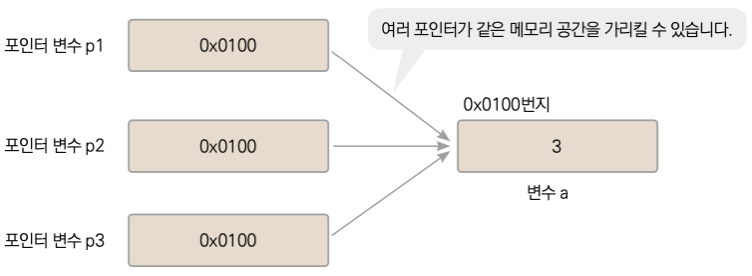

## Tucker의 Go 언어 프로그래밍 - 요약

<br>

### #5 포인터

<br><br>

### **포인터란?**

- 포인터는 **메모리 주소를 값으로 갖는 타입**이다.


- 예를 들어, **int** 타입의 변수 **a**가 있다고 가정하자. **a**는 메모리에 저장되며, 그 위치는 메모리 주소를 통해 식별된다.


- 변수 **a**의 주소가 예를 들어 **0x0100**이라고 한다면, 이 메모리 주소 역시 숫자값이므로 다른 변수에 할당될 수 있다. 이처럼 메모리 주소를 값으로 가지는 변수를 포인터 변수라고 한다.

<br>

```go
var p *int

p=&a
```

<br>

- 위 코드에서 포인터 변수 **p**에 **a**의 주소를 대입하는 구문을 볼 수 있다.


- 포인터 변수 **p**의 값은 변수 **a**의 주소인 **0x0100**이 되며, 이 상태에서 "포인터 변수 **p**가 변수 **a**를 가리킨다"고 표현한다. 포인터는 이처럼 메모리 주소를 값으로 가지며, 메모리 공간을 직접 가리키는 역할을 한다.


- 포인터를 활용하면, 여러 포인터 변수가 동일한 메모리 공간을 가리킬 수 있으며, 해당 메모리 공간의 값을 읽거나 수정할 수 있다. 이를 통해 함수간에 데이터를 효과적으로 전달하거나, 구조체와 같은 복잡한 데이터 구조를 효율적으로 관리할 수 있다.



<br><br>

### **포인터 변수 값 비교하기**

- == 연산을 사용해 포인터가 같은 메모리 공간을 가리키는지 확인할 수 있다.

```go
package main

import "fmt"

func main() {
	var a int = 10
	var b int = 20

	var p1 *int = &a
	var p2 *int = &a
	var p3 *int = &b

	fmt.Printf("p1 == p2 : %v\n", p1 == p2) // true
	fmt.Printf("p2 == p3 : %v\n", p2 == p3) // false
}
```

<br><br>

### **포인터의 기본 값 nil**

- 포인터 변수 값을 초기화하지 않으면 기본 값은 nil이다.


- 이 값은 0이지만 정확한 의미는 유효하지 않는 메모리 주소 값.
    - 즉, 어떤 메모리 공간도 가리키고 있지 않음을 나타낸다.


- 포인터 변수 p가 유효한 메모리 주소를 가리키는지 검사하는 구문이다.

```go
var p *int

if p != nil {
    // p가 nil이 아니라는 애기는 p가 유효한 메모리 주소를 가리킨다는 뜻이다.
}
```

<br><br>

### 왜 포인터를 사용하는가 ?

<br>

**성능 최적화**

- 변수 대입이나 함수 인수 전달 시 값 복사(copy)가 일어난다. 특히 큰 메모리를 가진 데이터 구조를 복사할 때는 많은 메모리를 사용하며, 이로 인한 성능 저하가 발생할 수 있다.


- 포인터를 사용하면 데이터 자체가 아닌 데이터의 메모리 주소만 복사된다. 이는 일반적으로 4바이트나 8바이트로, 데이터 구조의 크기와 상관없이 일정하다.

<br>

**데이터 변경**

- 값으로 전달된 변수(**Call by Value**)는 복사본이기 때문에 원본 데이터에는 영향을 주지 않는다. 즉, 함수 내부에서 변수를 변경해도 호출자의 변수는 변하지 않는다.


- 포인터를 사용하면, 원본 데이터의 메모리 주소에 직접 접근(**Call by Reference**)할 수 있다. 이를 통해 데이터를 효율적으로 조작하고, 함수 호출을 통해 원본 데이터를 변경할 수 있다.

<br><br>

### **Data 구조체와 포인터 변수 초기화**

```go
// 기존 방식: 변수를 선언하고 주소를 할당
var data Data
var p *Data = &data

// 직접 구조체를 생성하고 포인터 변수에 초기화
var p *Data = &Data{}

// 더 간결한 방식: new 함수 사용
var p *Data = new(Data)
```

- **&Data{}** 방식은 **Data** 타입의 구조체를 생성하고, 그 주소를 **p**에 할당한다. 이 방식은 구조체를 생성하고 초기화하는 과정을 한 줄에 담는다.


- **new(Data)** 방식은 **Data** 타입의 새로운 인스턴스를 메모리에 할당하고, 그 주소를 **p**에 할당한다. 이 방식은 주로 구조체의 필드를 기본값으로 초기화할 때 사용된다.

<br>

두 방식 모두 **p**는 메모리에 실제로 존재하는 **Data** 구조체를 가리키게 된다. 포인터 변수 **p**를 통해 구조체의 필드에 접근하고, 필요에 따라 값을 변경할 수 있다.

<br><br>

### **인스턴스**

- 인스턴스는 특정 타입의 변수가 메모리에 할당되어 실체화된 것을 의미한다.


- 구조체나 기본 데이터 타입 변수를 선언할 때, Go는 해당 타입의 인스턴스를 메모리에 할당한다.

<br>

**인스턴스 생성**

```go
var data Data
```

- 위 코드에서 **Data** 타입의 **data** 변수를 선언함으로써, **Data** 타입의 인스턴스가 메모리에 할당되었다. 이 메모리에 할당된 **Data** 타입의 실체를 인스턴스라고 부른다.

<br>

**포인터를 통한 인스턴스 참조**

```go
var data Data
var p *Data = &data
```

- 여기서 **Data** 타입 포인터 변수 **p**를 선언하고, **data**의 주소를 **p**에 대입했다. 이때, **p**는 **data** 인스턴스를 가리킨다고 말한다.


- 중요한 점은 새로운 **Data** 인스턴스가 생성된 것이 아니라, 기존에 있던 **data** 인스턴스의 주소를 **p**가 저장하고 있다는 것이다. 따라서 이 시점에서 생성된 **Data** 타입의 인스턴스는 하나 뿐이다.

<br>

**인스턴스 직접 생성과 포인터 할당**

```go
var p *Data = &Data{}
```

- 이 코드는 **Data** 타입의 새 인스턴스를 생성하고, 그 메모리 주소를 포인터 변수 **p**에 할당한다.


- &Data{}는 **Data** 타입의 새 인스턴스를 메모리에 할당하고, 그 주소를 반환한다. **p**는 이제 새로 할당된 **Data** 인스턴스를 가리킨다.

<br><br>

### **인스턴스는 언제 사라지나**

<br>

**메모리의 한계**

메모리는 한정된 자원이다. 프로그램이 메모리에 데이터를 계속 할당만 하고 해제하지 않으면, 결국 사용 가능한 메모리가 고갈되어 프로그램이 비정상적으로 종료될 수 있다.

<br>

**메모리 해제의 필요성**

데이터가 더 이상 필요하지 않게 되면, 해당 메모리를 해제하여 시스템에 반환하는 것이 중요하다. 이를 통해 메모리를 효율적으로 관리할 수 있다.

<br>

**Go 언어의 가비지 컬렉터**

Go는 자동 메모리 관리를 지원하는 언어다. Go의 가비지 컬렉터(Garbage Collector)는 프로그램이 동적으로 할당한 메모리 영역 중 더 이상 사용되지 않는 영역을 자동으로 찾아내고 해제한다. 가비지 컬렉터는 일정 간격으로 동작하며, 더 이상 참조되지 않는 객체(인스턴스)를 메모리에서 제거한다.

<br>

**가비지 컬렉터의 성능 고려**

가비지 컬렉터는 매우 유용하지만, 전체 메모리를 검사해야 하므로 성능에 영향을 줄 수 있다. 큰 메모리 영역을 관리해야 할 경우, 가비지 컬렉션으로 인한 성능 저하가 발생할 가능성이 있다. 그러나 Go의 가비지 컬렉터는 성능 최적화가 잘 되어 있으며, 최신 버전의 Go에서는 가비지 컬렉션으로 인한 지연이 상당히 줄어들었다.

<br>

**포인터와 인스턴스의 관계**

포인터를 사용하여 인스턴스에 접근할 수 있다. 함수 호출 시 포인터 인수를 통해 인스턴스를 전달하면, 함수 내에서 해당 인스턴스의 값을 변경할 수 있다.
인스턴스가 더 이상 필요하지 않고 어떤 포인터도 해당 인스턴스를 참조하지 않게 되면, 가비지 컬렉터는 해당 인스턴스를 쓸모없는 데이터로 간주하고 메모리에서 자동으로 제거한다.

```go
package main

import (
	"fmt"
)

type Data struct {
	Value int
}

// modify 함수는 Data 구조체의 포인터를 인수로 받아 Value 필드를 변경한다.
func modify(d *Data) {
	d.Value = 10 // 포인터를 통해 인스턴스의 Value 필드를 변경
}

func main() {
	// Data 인스턴스 생성 및 포인터 변수 d에 주소 할당
	d := &Data{Value: 5}

	// modify 함수 호출. d 포인터를 전달하여 인스턴스의 값을 변경한다.
	modify(d)

	// 이 시점에서 d는 더 이상 사용되지 않으므로, 가비지 컬렉터가 메모리를 해제할 수 있다.
	// Go의 가비지 컬렉터는 필요할 때 메모리를 자동으로 정리한다.
}
```

<br><br>

### **스택 메모리와 힙 메모리**

Go는 효율적인 메모리 관리를 위해 탈출 분석(escape analysis)을 수행하여 변수가 스택에 할당될지, 아니면 힙에 할당될지를 결정한다.

<br>

**탈출 분석과 메모리 할당**

- Go 컴파일러는 탈출 분석을 수행하여 함수 내에서 생성된 변수가 함수 범위를 벗어나 사용 되는지를 검사한다. 함수 외부로 공개되어야 하는 인스턴스의 경우, 함수가 종료되어도 메모리에서 사라지지 않는다.


- 이러한 경우, 해당 변수는 스택 메모리가 아닌 힙 메모리에 할당된다. 이는 변수의 수명이 함수 호출의 범위를 넘어서 확장될 수 있음을 의미한다.

<br>

**스택 메모리와 힙 메모리의 사용 결정**

- Go 언어에서는 타입이나 메모리 할당 함수에 의해 스택 메모리 사용 여부가 결정되는 것이 아니라, 탈출 분석의 결과에 따라 결정된다.


- 컴파일 시간에 메모리 공간이 함수 외부로 공개되는지 여부를 자동으로 검사하고, 그에 따라 스택 메모리에 할당할지 힙 메모리에 할당할지를 결정한다.

<br>

**스택 메모리의 특징**

- Go 언어에서 스택 메모리는 함수 호출과 함께 할당되며, 함수가 반환될 때 자동으로 해제된다. 이는 스택 메모리가 빠른 할당과 해제를 가능하게 하며, 함수의 지역 변수에 주로 사용된다.


- 반면, 힙 메모리는 수명이 더 긴 데이터를 위해 사용되며, 가비지 컬렉터에 의해 관리된다. 힙 메모리는 할당과 해제가 스택 메모리보다 느리지만, 더 유연한 수명 관리를 가능하게 한다.

<br>